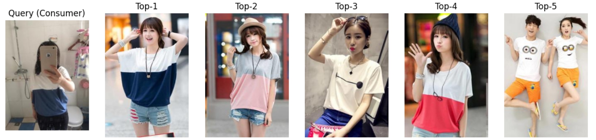
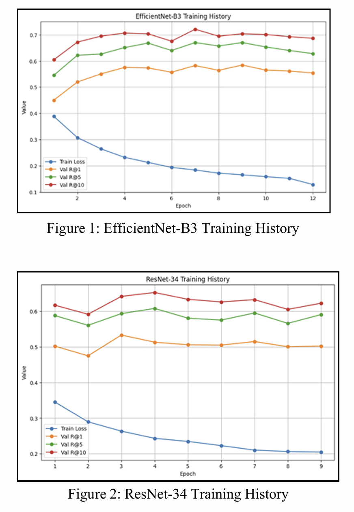

# Consumer-to-Shop-Clothing-Retrieval-Using-Deep-Learning
This is a repository of Consumer-to-Shop Clothing Retrieval Using Deep Learning project in 2025-2, Computer Vision, Ewha Womans University. 

This project addresses the Consumer-to-Shop (C2S) fashion image retrieval problem by formulating it as a metric learning–based retrieval task. Using a sampled subset of the DeepFashion C2S dataset, we construct an embedding-based retrieval pipeline and analyze the impact of backbone selection, loss functions, and preprocessing strategies. EfficientNet-B3 with Batch-Hard Triplet Loss achieves the best overall performance among the tested configurations. We further demonstrate that careful preprocessing design and embedding dimension selection improve retrieval performance without modifying the model architecture. The final model achieves Recall@1, Recall@5 and Recall@10 of 0.6402, 0.7280 and 0.7751 on the test set, highlighting the importance of embedding design in consumer-to-shop fashion retrieval.

## Repository Structure

This repository is organized to clearly separate **intermediate experiments** from the **final demo used for evaluation**.

- **01_data/**  
  Scripts and artifacts related to dataset construction, filtering, and sampling.  

- **02_preprocessing/**  
  Exploratory notebooks and experiments on basic preprocessing strategies(stage1), and advanced preprocessing stategies after model selection including embedding normalization, domain normalization, data augmentation, and image bounding box gap analysis.

- **03_model_experiments/**  
  Model comparison and ablation experiments conducted during development, such as backbone selection and loss function exploration.

- **04_demo/**  
  **Final demo folder for evaluation.**  
  This directory contains the cleaned and finalized notebook(s) required to reproduce the final quantitative results and qualitative retrieval demo.  

- **05_live_demo/**  
  **Live demo folder for presentation.**  
  This directory contains the live demo code, including intuitive visualizations for presentation purposes.

- **report/**  
  Final report and presentation materials.

## 🛠️ Key Contributions

I was responsible for the core design and experimental analysis throughout the project.

### ✅ Topic Selection & Dataset Collection
* Selected **"Image-based Product Search"** as the core topic, addressing the high demand in real-world e-commerce environments.
* Utilized the **DeepFashion C2S benchmark dataset** to define and address the significant domain gap between consumer and shop images.

### ✅ Dataset Sampling Strategy
* **Problem**: The original DeepFashion dataset was too large for training under limited computational resources.
* **Solution**: Conducted **Item ID-level sampling** to reduce volume while preserving intra-item variability and data diversity.
* **Result**: Configured the dataset with a **Train/Val/Test ratio of 8:1:1**, ensuring sufficient positive pairs for each item so the model could learn meaningful embeddings.

### ✅ Backbone Selection & Comparative Analysis
* **Experimental Setup**: Compared model architectures while fixing the loss function to **Semi-Hard Triplet Loss**.
* **Models Compared**: **ResNet-34 vs. EfficientNet-B3**.
* **Analysis & Results**: Confirmed that **EfficientNet-B3** achieved a faster decrease in loss and significantly better performance across all **Recall@K** metrics.
* **Conclusion**: Analyzed that EfficientNet’s **Compound Scaling** provides a substantial advantage for fine-grained fashion feature extraction, leading to its selection as the final backbone.

### ✅ Embedding Dimension Optimization
* **Experiment**: Compared embedding dimensions (**128, 256, and 512**) to find the optimal balance between representational power and generalization.
* **Results**:
    * **128-dim**: Lacked the capacity to fully compress rich fashion features extracted by the backbone.
    * **512-dim**: Performance declined due to the **Curse of Dimensionality**, where feature space sparsity hindered generalization.
    * **256-dim**: Recorded the highest **Recall@5** performance on the validation set, identifying it as the optimal dimension for the final model.
